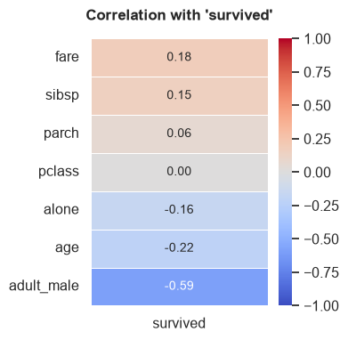
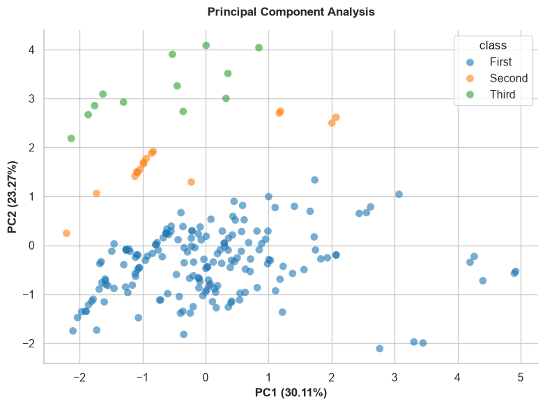
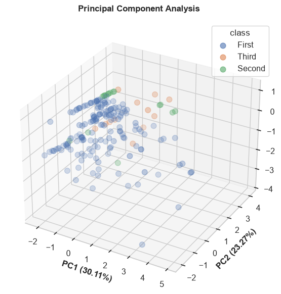
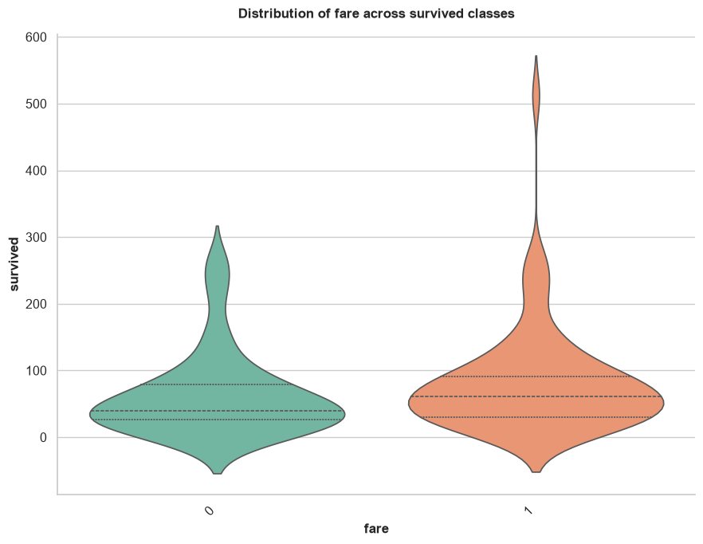
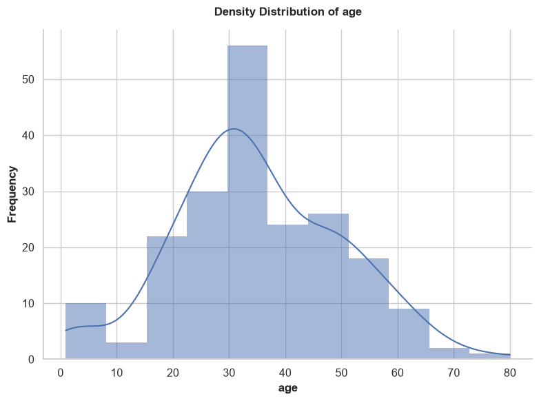
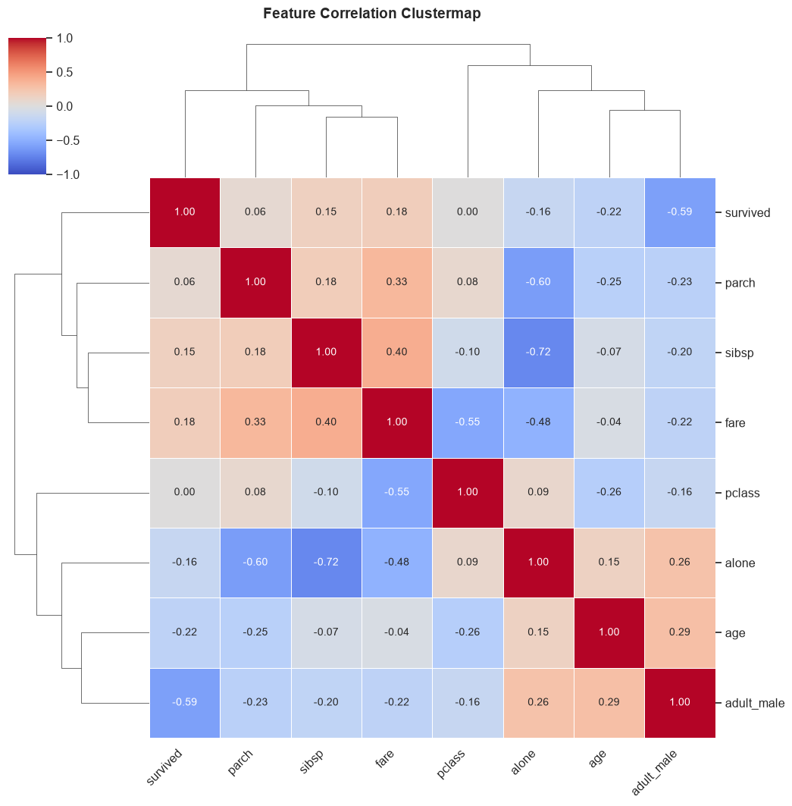

# Data Visualization (Visuals)

Data visualization is crucial for exploring relationships, distributions, and underlying patterns within your dataset. The **Visuals** methods in QPX Tabular provide robust, production-ready plotting functions designed to instantly generate high-quality insights with minimal code.

## Available Methods at a Glance

**Visual Methods:**
- `corr_map()`
- `pca_plot()`
- `relationship_map()`
- `distribution_map()`
- `feature_cluster_map()`

---

## Visual Methods

### `corr_map()`
Generates a heatmap displaying the correlation matrix of numerical features. If a `target` variable is specified, it plots the correlation of all other features directly against the target.

**Parameters:**
- `target` *(str, optional)*: Specific target column to compute correlations against.
- `ignore_cols` *(list, optional)*: List of column names to explicitly exclude from the correlation map.
- `method` *(str, default="spearman")*: Correlation method (`"pearson"`, `"kendall"`, `"spearman"`).

**Example:**
```python
# Plot correlations specifically against 'survived'
tab.corr_map(target="survived", method="spearman")
```


---

### `pca_plot()`
Performs Principal Component Analysis (PCA) and visualizes the variance captured in reduced dimensions. Useful for dimensionality reduction analysis.

**Parameters:**
- `input_cols` *(list, optional)*: Specific numerical columns to use for PCA. If None, uses all numeric columns.
- `target` *(str, optional)*: Categorical target column used to color-code the data points.
- `n_components` *(int, default=2)*: Number of PCA components to plot (2 or 3).
- `sample_space` *(int, optional)*: Limit the number of rows plotted to speed up rendering for large datasets.
- `figsize` *(tuple, default=(8, 6))*: The figure dimensions.

**Example:**
```python
# Plot a 2D PCA color-coded by the 'class' target
tab.pca_plot(target="class", n_components=2)
```


```python
# Generate an interactive 3D PCA plot
tab.pca_plot(target="class", n_components=3)
```


---

### `relationship_map()`
Automatically generates appropriate bivariate plots to show the relationship between input features and a specific target variable. It intelligently chooses scatter plots, box plots, or count plots based on whether the variables are numerical or categorical.

**Parameters:**
- `target` *(str)*: Required. The target column to compare everything against.
- `input_cols` *(list, optional)*: Specific columns to plot against the target. If None, uses all columns.
- `ignore_cols` *(list, optional)*: List of column names to explicitly skip (e.g., IDs or names).
- `sample_space` *(int, default=1000)*: Subsamples data for performance.
- `figsize` *(tuple, default=(9, 7))*: The figure dimensions.

**Example:**
```python
tab.relationship_map(target="survived", input_cols=["fare"])
```


---

### `distribution_map()`
Generates univariate distribution plots for your features. It automatically selects histograms (with density curves) for numerical data, and count plots for categorical data. It contains built-in logic to automatically skip useless identifiers (e.g., columns containing 'id', 'ticket', 'uuid', 'hash', 'url') and high-cardinality nominals.

**Parameters:**
- `cols` *(list, optional)*: Specific columns to plot. If None, plots all eligible columns.
- `ignore_cols` *(list, optional)*: List of column names to explicitly skip.
- `sample_space` *(int, default=1000)*: Subsamples data for performance.
- `figsize` *(tuple, default=(8, 6))*: The figure dimensions.

**Example:**
```python
tab.distribution_map(cols=["age"])
```


---

### `feature_cluster_map()`
Generates a hierarchically-clustered heatmap of correlations. This powerful visualization groups highly correlated features together, making it incredibly easy to identify multicollinear clusters that could destabilize machine learning models.

**Parameters:**
- `ignore_cols` *(list, optional)*: List of column names to skip.
- `method` *(str, default="spearman")*: Correlation method (`"pearson"`, `"kendall"`, `"spearman"`).
- `figsize` *(tuple, default=(10, 10))*: The figure dimensions.

**Example:**
```python
tab.feature_cluster_map()
```

